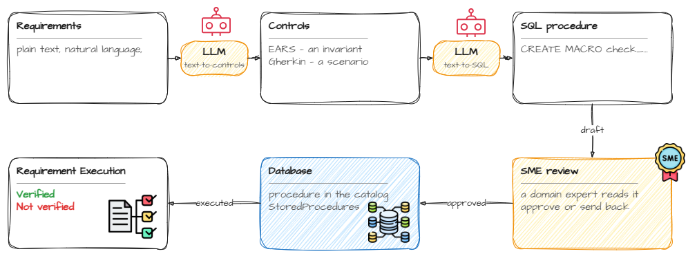

# Requirements validation — worked examples

Companion code for the post **[Towards Repeatable Compliance](https://anaivebidder.com/posts/towards-repeatable-compliance/)**.

Two ordinary business rules — maker-checker on transfers, and 20 consecutive days
of mandatory leave — written in three notations, compiled to SQL, stored as
procedures, and run against operational data with every result recorded.



An LLM can draft the controls and the SQL. It cannot sign off on either, so a
domain expert reviews the procedure before it is stored; after that the database
answers, on demand, which requirements held and which did not.

Everything in the post is reproduced by one file. There is no server, no
framework and no build step.

---

## What you need

[DuckDB](https://duckdb.org/docs/installation/) 1.0 or newer, on the `PATH`.
Nothing else — no extensions, no network access.

```sh
duckdb -c "SELECT version()"
```

Developed against v1.5.5. The script uses only core SQL plus `CREATE MACRO ... AS TABLE`,
`datediff`, `make_date`, `arg_max` and `duckdb_functions()`.

---

## Quick start

```sh
duckdb < requirements-validation.sql
```

That prints the eight result tables from the post, in the order the post shows
them. It runs in memory, so it is repeatable and leaves nothing behind.

To keep the database and poke at it afterwards:

```sh
duckdb requirements.db < requirements-validation.sql
duckdb requirements.db      # then: SELECT * FROM validate_req_201(2026);
```

The script *creates* its tables rather than replacing them, so the second form
needs a database file that does not exist yet. Re-running it over a database it
already populated is a catalog error, not a reset — delete the file first.

---

## Step by step

Each step below matches a section of the post. Run the whole script first
(above), then open an interactive session and follow along:

```sh
duckdb requirements.db < requirements-validation.sql
duckdb requirements.db
```

### 1. The register — "The database schema"

Four tables hold the requirements side. `Requirement` is plain text plus a
MoSCoW `importance` and the name of its validation procedure:

```sql
SELECT reqId, importance, validationProcedure FROM Requirement;
```

Two requirements, both `Must`. The methodology lives one level down, on the
controls — one requirement is checked several ways:

```sql
SELECT controlId, methodology FROM Control ORDER BY controlId;
```

Eight controls: four EARS, four Gherkin. MoSCoW appears nowhere here, because it
compiles to nothing — it is an attribute, not a query.

### 2. What is actually runnable — "Running them"

`StoredProcedures` points at the control it checks, one row each. The register
asserts a procedure name; whether that procedure exists is a separate question.
Ask the catalog:

```sql
SELECT sp.controlId, sp.procedureName,
       CASE WHEN f.function_name IS NULL THEN 'MISSING' ELSE 'ok' END AS in_catalog
  FROM StoredProcedures sp
  LEFT JOIN duckdb_functions() f
         ON f.function_name = sp.procedureName
        AND f.function_type = 'table_macro'
 ORDER BY sp.controlId;
```

All eight come back `ok`. The value is that the question is answerable:
experiment 5 in `experiments.sql` drops a procedure and the same query reports
`MISSING`, with no change to the register.

### 3. Use case 1: maker-checker

EARS compiles to an **invariant** — any row it returns is a violation, so a
clean run returns nothing:

```sql
SELECT * FROM check_req_102();
```

One row comes back: `WT-2002`, released by the same person who initiated it.

Gherkin compiles to an **assertion** that carries its own expected answer, so it
returns a verdict per scenario rather than a list to interpret:

```sql
SELECT * FROM check_scenario_102() ORDER BY scenario;
```

Same fact, reported differently: `initiator-cannot-release-own-transfer` comes
back `FAIL`.

### 4. Use case 2: mandatory leave

The rule says *20 **consecutive** days, each year*, and both italicised words
cost something. Periods that touch are one absence, so they are merged into
blocks; and a block spanning New Year belongs wholly to neither year, so periods
are clipped to the year first. Both ideas live in `leave_blocks(yr)`:

```sql
SELECT * FROM leave_blocks(2026) ORDER BY employeeId;
SELECT * FROM check_req_201(2026);
SELECT * FROM check_scenario_201(2026) ORDER BY scenario;
```

`check_req_201` returns MEI with `total_leave_days = 20` and
`longest_consecutive_block = 5`. Those two numbers are the point of the post:
the first is what a leave-balance report shows, the second is what the
requirement actually asked for.

Note that the Gherkin control passes here while the organisation is
non-compliant — it asserts that the checker behaves correctly, which it does.
A green scenario is not a green requirement.

### 5. Validating a requirement — "Validating a requirement"

Each requirement names one procedure that runs all of its controls. Controls
with no runnable check are reported as such rather than skipped:

```sql
SELECT * FROM validate_req_102() ORDER BY controlId;
SELECT * FROM validate_req_201(2026) ORDER BY controlId;
```

All eight rows come back with a verdict, and two of them are `FAIL`.

### 6. The register, answered — "Validating all the requirements"

`ControlResult` records every run — that is the post's "Recording what happened".
The last query in the script joins it back to the register, so each requirement can
finally be asked whether it held:

```sql
SELECT * FROM Requirement;   -- and see the script's final query
```

Both requirements come back `FAIL`, dated, with the detail attached.

---

## The two findings

The sample data is arranged so that each way of *not being verified* shows up as
a different query with a different answer:

| Finding | Where it surfaces | Control |
|---|---|---|
| A check that fails | `check_req_102()` returns a row | `REQ-102-C1` |
| A check that passes while the org is non-compliant | `validate_req_201(2026)` | `REQ-201-C2` |

The second is the more dangerous: the control is green because the checker
behaves correctly, and the organisation is still non-compliant.

---

## Verifying the checks actually work

A control you have only seen pass, or only seen fail, has not been tested.
`experiments.sql` perturbs the data and shows the checks responding, then puts
it back:

```sh
cat requirements-validation.sql experiments.sql | duckdb
```

It demonstrates that:

1. the Gherkin scenario tracks *who* released the transfer, not merely whether a
   release exists — fix the data and it goes green with the EARS check
2. a 25-day block over New Year satisfies neither year, and a real 20-day block
   inside one year clears the check
3. touching and overlapping leave periods collapse into a single absence
4. a requirement whose controls never ran reports `incomplete` or
   `(no evidence)`, never `pass`
5. dropping a procedure is visible in the catalog before anything is run

---

## Schema

```
Requirement(reqId, description, importance, validationProcedure)
    │
    └─< Control(controlId, reqId, methodology, description)
            │
            ├─< StoredProcedures(procedureName, controlId)
            └─< ControlResult(timestamp, reqId, controlId, result, description)

Employee(emp_id, name, job_role, decision_maker)
Transfer(transfer_id, amount_eur, initiated_by, initiated_at)
TransferRelease(transfer_id, released_by, released_at)
Leaves(employeeId, startDate, endDate)
```

The top half is the requirements register; the bottom half is ordinary
operational data. The procedures are the only thing joining them, which is the
whole argument of the post.

`initiated_by`, `released_by` and `employeeId` all hold `Employee.emp_id`.
`Leaves` stores one row per leave *period*, not per day — the day counts are
derived.

---

## Files

| File | What it is |
|---|---|
| [`requirements-validation.sql`](requirements-validation.sql) | The whole worked example: schema, sample rows, ten procedures, and the eight queries the post prints. |
| [`experiments.sql`](experiments.sql) | Perturbs the data to show the controls responding. Run it appended to the script above. |
| [`requirements-pipeline.png`](requirements-pipeline.png) | The figure above. Drawn in draw.io, and re-editable there — the diagram source is embedded in the PNG. |

---

## A note on the data

`DANA`, `RAVI`, `MEI`, the two transfers and all leave periods are fictional,
and chosen to make the failure modes visible in as few rows as possible. MEI
takes exactly 20 days of leave in four separate weeks — enough to satisfy any
leave-balance report, and not once the rule that was actually written down.
